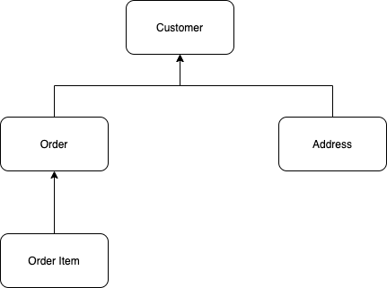
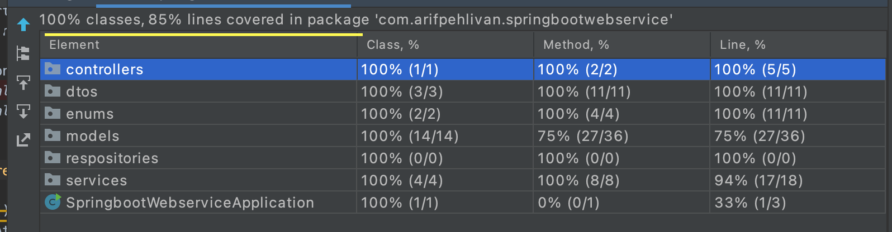

# Springboot Webservice Example 
In this project, you can see an example of spring boot webservice project.

## Entity Relation

## Test Coverage

## Used Technologies

- Spring Boot (Spring Data, Spring Web)
- JUnit 4
- Lombok
- H2
